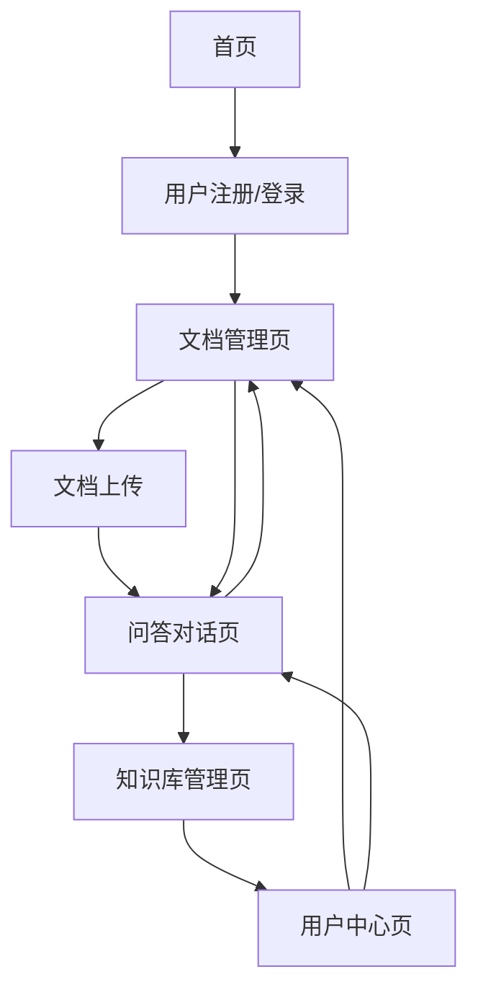

# AI 文档问答知识库 - 产品需求文档

## 1. 产品概述

AI 文档问答知识库是一个基于大语言模型和检索增强生成（RAG）技术的智能文档问答平台，旨在为用户提供高效、准确的文档内容检索和问答服务。该产品通过先进的自然语言处理技术，将传统的文档管理转变为智能化的知识问答体验。

产品解决的核心问题：企业和个人在面对大量文档时，难以快速准确地获取所需信息，传统的关键词搜索无法理解语义，导致信息检索效率低下。

目标市场价值：预计在企业知识管理、教育培训、法律咨询等领域具有广阔的应用前景，市场规模预计达到数十亿美元。

## 2. 核心功能

### 2.1 用户角色

| 角色 | 注册方式 | 核心权限 |
|------|----------|----------|
| 普通用户 | 邮箱注册 | 可上传文档、进行问答、查看个人知识库 |
| 企业用户 | 企业认证 | 可创建团队知识库、管理用户权限、查看使用统计 |
| 管理员 | 系统分配 | 可管理所有用户、监控系统状态、配置系统参数 |

### 2.2 功能模块

我们的AI文档问答知识库包含以下主要页面：

1. **首页**：产品介绍、功能展示、快速开始引导
2. **文档管理页**：文档上传、分类管理、索引状态查看
3. **问答对话页**：智能问答界面、多轮对话、历史记录
4. **知识库管理页**：知识库创建、权限设置、共享管理
5. **用户中心页**：个人信息、使用统计、订阅管理

### 2.3 页面详情

| 页面名称 | 模块名称 | 功能描述 |
|----------|----------|----------|
| 首页 | 产品介绍区 | 展示产品核心价值、功能亮点、使用案例 |
| 首页 | 快速开始区 | 提供新用户引导、示例演示、注册入口 |
| 文档管理页 | 文档上传模块 | 支持PDF、Word、Markdown等格式上传，批量处理，进度显示 |
| 文档管理页 | 文档列表模块 | 显示文档列表、分类筛选、搜索功能、索引状态 |
| 文档管理页 | 文档预览模块 | 在线预览文档内容、高亮显示、分页浏览 |
| 问答对话页 | 对话界面模块 | 实时问答交互、消息气泡显示、输入框优化 |
| 问答对话页 | 历史记录模块 | 对话历史查看、搜索过滤、导出功能 |
| 问答对话页 | 引用展示模块 | 显示答案来源、原文引用、跳转链接 |
| 知识库管理页 | 知识库创建模块 | 创建新知识库、设置名称描述、选择文档范围 |
| 知识库管理页 | 权限管理模块 | 设置访问权限、用户邀请、角色分配 |
| 知识库管理页 | 共享设置模块 | 生成分享链接、设置访问密码、有效期管理 |
| 用户中心页 | 个人信息模块 | 编辑个人资料、修改密码、绑定邮箱 |
| 用户中心页 | 使用统计模块 | 查看问答次数、文档数量、存储使用情况 |
| 用户中心页 | 订阅管理模块 | 查看当前套餐、升级选项、账单历史 |

## 3. 核心流程

### 普通用户流程
1. 用户注册登录 → 上传文档到知识库 → 等待文档解析和向量化 → 开始问答对话 → 查看答案和引用来源

### 企业用户流程
1. 企业认证注册 → 创建团队知识库 → 邀请团队成员 → 批量上传企业文档 → 设置访问权限 → 团队协作问答

### 系统处理流程
1. 文档上传 → 格式解析 → 文本提取 → 分块处理 → 向量化 → 存储到向量数据库 → 用户问答 → 语义检索 → LLM生成答案 → 返回结果

## 4. 用户界面设计

### 4.1 设计风格

- **主色调**：深蓝色 (#1E40AF) 和浅蓝色 (#3B82F6)
- **辅助色**：灰色 (#6B7280) 和绿色 (#10B981)
- **按钮样式**：圆角矩形，渐变背景，悬停效果
- **字体**：中文使用思源黑体，英文使用 Inter，主要字号 14px-16px
- **布局风格**：卡片式设计，左侧导航，响应式布局
- **图标风格**：线性图标，统一的视觉语言，支持深色模式

### 4.2 页面设计概览

| 页面名称 | 模块名称 | UI元素 |
|----------|----------|--------|
| 首页 | 产品介绍区 | 大标题、特性卡片、渐变背景、CTA按钮 |
| 首页 | 快速开始区 | 步骤指引、动画演示、注册表单 |
| 文档管理页 | 文档上传模块 | 拖拽上传区域、进度条、文件类型图标 |
| 文档管理页 | 文档列表模块 | 表格布局、状态标签、操作按钮、分页器 |
| 问答对话页 | 对话界面模块 | 消息气泡、头像、时间戳、输入框、发送按钮 |
| 问答对话页 | 引用展示模块 | 引用卡片、高亮文本、来源链接、展开/收起 |
| 知识库管理页 | 知识库创建模块 | 表单输入、文档选择器、预览面板 |
| 用户中心页 | 使用统计模块 | 图表展示、数据卡片、趋势线、环形图 |

### 4.3 响应式设计

产品采用移动优先的响应式设计，支持桌面端、平板和手机端访问。在移动端优化触摸交互，增大点击区域，简化操作流程。桌面端充分利用屏幕空间，提供更丰富的功能和更高效的操作体验。