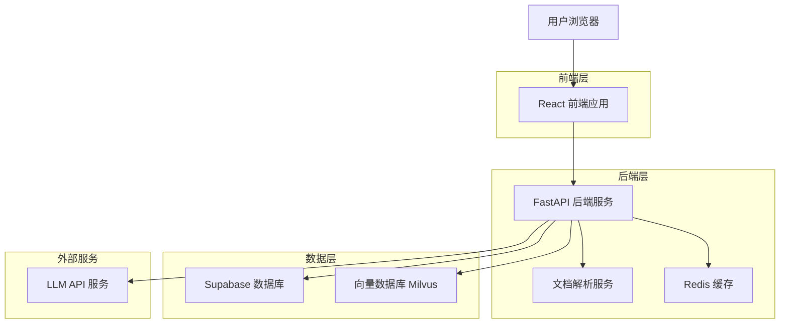
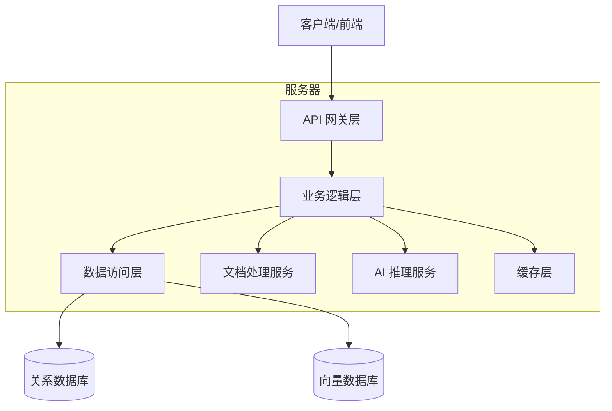
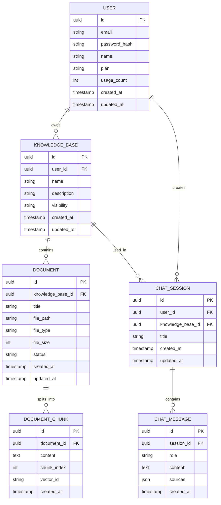

# AI 文档问答知识库 - 技术架构文档

## 1. 架构设计



## 2. 技术描述

* **前端**: React\@18 + TypeScript + TailwindCSS + Vite + React Query

* **后端**: Python FastAPI + Pydantic + SQLAlchemy + Celery

* **数据库**: Supabase (PostgreSQL) + Milvus (向量数据库) + Redis (缓存)

* **AI服务**: OpenAI API / Ollama + SentenceTransformers + LangChain

* **文档处理**: PyPDF2 + python-docx + markdown + Unstructured

* **部署**: Docker + Docker Compose + Nginx

## 3. 路由定义

| 路由              | 用途               |
| --------------- | ---------------- |
| /               | 首页，展示产品介绍和功能特性   |
| /login          | 登录页面，用户身份验证      |
| /register       | 注册页面，新用户注册       |
| /dashboard      | 仪表板页面，用户主要工作区    |
| /documents      | 文档管理页面，上传和管理文档   |
| /chat           | 问答对话页面，与知识库进行对话  |
| /knowledge-base | 知识库管理页面，创建和管理知识库 |
| /profile        | 用户中心页面，个人信息和设置   |
| /admin          | 管理员页面，系统管理和监控    |

## 4. API 定义

### 4.1 核心 API

#### 用户认证相关

```
POST /api/auth/register
```

请求参数:

| 参数名      | 参数类型   | 是否必需 | 描述   |
| -------- | ------ | ---- | ---- |
| email    | string | true | 用户邮箱 |
| password | string | true | 用户密码 |
| name     | string | true | 用户姓名 |

响应参数:

| 参数名      | 参数类型    | 描述     |
| -------- | ------- | ------ |
| success  | boolean | 注册是否成功 |
| message  | string  | 响应消息   |
| user\_id | string  | 用户ID   |

示例:

```json
{
  "email": "user@example.com",
  "password": "securepassword",
  "name": "张三"
}
```

#### 文档管理相关

```
POST /api/documents/upload
```

请求参数:

| 参数名                 | 参数类型   | 是否必需  | 描述      |
| ------------------- | ------ | ----- | ------- |
| file                | file   | true  | 上传的文档文件 |
| knowledge\_base\_id | string | true  | 知识库ID   |
| title               | string | false | 文档标题    |

响应参数:

| 参数名          | 参数类型   | 描述   |
| ------------ | ------ | ---- |
| document\_id | string | 文档ID |
| status       | string | 处理状态 |
| message      | string | 响应消息 |

#### 问答对话相关

```
POST /api/chat/ask
```

请求参数:

| 参数名                 | 参数类型   | 是否必需  | 描述    |
| ------------------- | ------ | ----- | ----- |
| question            | string | true  | 用户问题  |
| knowledge\_base\_id | string | true  | 知识库ID |
| session\_id         | string | false | 会话ID  |

响应参数:

| 参数名         | 参数类型   | 描述    |
| ----------- | ------ | ----- |
| answer      | string | 生成的答案 |
| sources     | array  | 引用来源  |
| session\_id | string | 会话ID  |

## 5. 服务器架构图



## 6. 数据模型

### 6.1 数据模型定义



### 6.2 数据定义语言

#### 用户表 (users)

```sql
-- 创建用户表
CREATE TABLE users (
    id UUID PRIMARY KEY DEFAULT gen_random_uuid(),
    email VARCHAR(255) UNIQUE NOT NULL,
    password_hash VARCHAR(255) NOT NULL,
    name VARCHAR(100) NOT NULL,
    plan VARCHAR(20) DEFAULT 'free' CHECK (plan IN ('free', 'pro', 'enterprise')),
    usage_count INTEGER DEFAULT 0,
    created_at TIMESTAMP WITH TIME ZONE DEFAULT NOW(),
    updated_at TIMESTAMP WITH TIME ZONE DEFAULT NOW()
);

-- 创建索引
CREATE INDEX idx_users_email ON users(email);
CREATE INDEX idx_users_created_at ON users(created_at DESC);

-- 设置权限
GRANT SELECT ON users TO anon;
GRANT ALL PRIVILEGES ON users TO authenticated;
```

#### 知识库表 (knowledge\_bases)

```sql
-- 创建知识库表
CREATE TABLE knowledge_bases (
    id UUID PRIMARY KEY DEFAULT gen_random_uuid(),
    user_id UUID NOT NULL REFERENCES users(id) ON DELETE CASCADE,
    name VARCHAR(255) NOT NULL,
    description TEXT,
    visibility VARCHAR(20) DEFAULT 'private' CHECK (visibility IN ('private', 'public', 'shared')),
    created_at TIMESTAMP WITH TIME ZONE DEFAULT NOW(),
    updated_at TIMESTAMP WITH TIME ZONE DEFAULT NOW()
);

-- 创建索引
CREATE INDEX idx_knowledge_bases_user_id ON knowledge_bases(user_id);
CREATE INDEX idx_knowledge_bases_created_at ON knowledge_bases(created_at DESC);

-- 设置权限
GRANT SELECT ON knowledge_bases TO anon;
GRANT ALL PRIVILEGES ON knowledge_bases TO authenticated;
```

#### 文档表 (documents)

```sql
-- 创建文档表
CREATE TABLE documents (
    id UUID PRIMARY KEY DEFAULT gen_random_uuid(),
    knowledge_base_id UUID NOT NULL REFERENCES knowledge_bases(id) ON DELETE CASCADE,
    title VARCHAR(255) NOT NULL,
    file_path VARCHAR(500) NOT NULL,
    file_type VARCHAR(50) NOT NULL,
    file_size INTEGER NOT NULL,
    status VARCHAR(20) DEFAULT 'processing' CHECK (status IN ('processing', 'completed', 'failed')),
    created_at TIMESTAMP WITH TIME ZONE DEFAULT NOW(),
    updated_at TIMESTAMP WITH TIME ZONE DEFAULT NOW()
);

-- 创建索引
CREATE INDEX idx_documents_knowledge_base_id ON documents(knowledge_base_id);
CREATE INDEX idx_documents_status ON documents(status);
CREATE INDEX idx_documents_created_at ON documents(created_at DESC);

-- 设置权限
GRANT SELECT ON documents TO anon;
GRANT ALL PRIVILEGES ON documents TO authenticated;
```

#### 文档块表 (document\_chunks)

```sql
-- 创建文档块表
CREATE TABLE document_chunks (
    id UUID PRIMARY KEY DEFAULT gen_random_uuid(),
    document_id UUID NOT NULL REFERENCES documents(id) ON DELETE CASCADE,
    content TEXT NOT NULL,
    chunk_index INTEGER NOT NULL,
    vector_id VARCHAR(255),
    created_at TIMESTAMP WITH TIME ZONE DEFAULT NOW()
);

-- 创建索引
CREATE INDEX idx_document_chunks_document_id ON document_chunks(document_id);
CREATE INDEX idx_document_chunks_vector_id ON document_chunks(vector_id);

-- 设置权限
GRANT SELECT ON document_chunks TO anon;
GRANT ALL PRIVILEGES ON document_chunks TO authenticated;
```

#### 聊天会话表 (chat\_sessions)

```sql
-- 创建聊天会话表
CREATE TABLE chat_sessions (
    id UUID PRIMARY KEY DEFAULT gen_random_uuid(),
    user_id UUID NOT NULL REFERENCES users(id) ON DELETE CASCADE,
    knowledge_base_id UUID NOT NULL REFERENCES knowledge_bases(id) ON DELETE CASCADE,
    title VARCHAR(255) NOT NULL,
    created_at TIMESTAMP WITH TIME ZONE DEFAULT NOW(),
    updated_at TIMESTAMP WITH TIME ZONE DEFAULT NOW()
);

-- 创建索引
CREATE INDEX idx_chat_sessions_user_id ON chat_sessions(user_id);
CREATE INDEX idx_chat_sessions_knowledge_base_id ON chat_sessions(knowledge_base_id);
CREATE INDEX idx_chat_sessions_created_at ON chat_sessions(created_at DESC);

-- 设置权限
GRANT SELECT ON chat_sessions TO anon;
GRANT ALL PRIVILEGES ON chat_sessions TO authenticated;
```

#### 聊天消息表 (chat\_messages)

```sql
-- 创建聊天消息表
CREATE TABLE chat_messages (
    id UUID PRIMARY KEY DEFAULT gen_random_uuid(),
    session_id UUID NOT NULL REFERENCES chat_sessions(id) ON DELETE CASCADE,
    role VARCHAR(20) NOT NULL CHECK (role IN ('user', 'assistant')),
    content TEXT NOT NULL,
    sources JSONB,
    created_at TIMESTAMP WITH TIME ZONE DEFAULT NOW()
);

-- 创建索引
CREATE INDEX idx_chat_messages_session_id ON chat_messages(session_id);
CREATE INDEX idx_chat_messages_created_at ON chat_messages(created_at DESC);

-- 设置权限
GRANT SELECT ON chat_messages TO anon;
GRANT ALL PRIVILEGES ON chat_messages TO authenticated;
```

#### 初始化数据

```sql
-- 插入示例用户
INSERT INTO users (email, password_hash, name, plan) VALUES
('admin@example.com', '$2b$12$example_hash', '管理员', 'enterprise'),
('demo@example.com', '$2b$12$example_hash', '演示用户', 'free');

-- 插入示例知识库
INSERT INTO knowledge_bases (user_id, name, description, visibility) VALUES
((SELECT id FROM users WHERE email = 'demo@example.com'), '演示知识库', '这是一个演示用的知识库', 'public');
```

